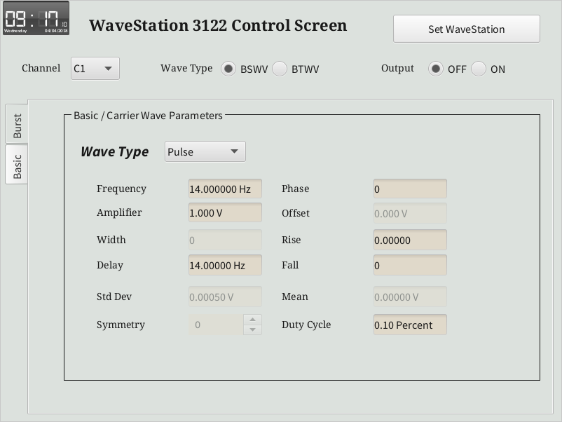
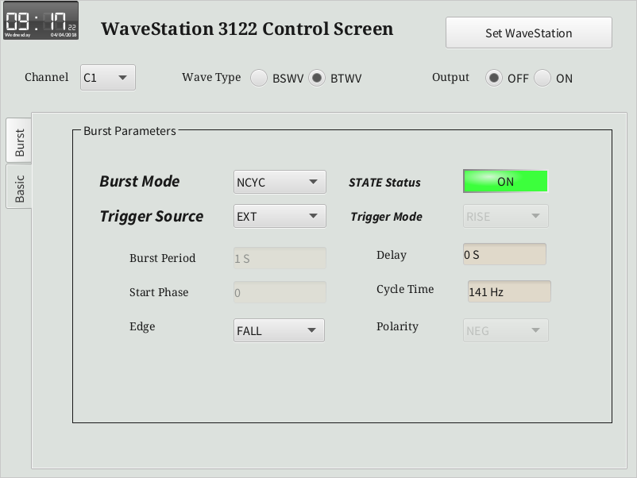

User Interface
======
The user interface was designed to mimic the WaveStation 3122 buttons and screen. Due to the limitation on the vendor SCPI commands, the strict order should be used to create proper signals if one would like to use the Brust Wave Mode.

# Basic Wave Setting Screen

# Burst Wave Setting Screen

